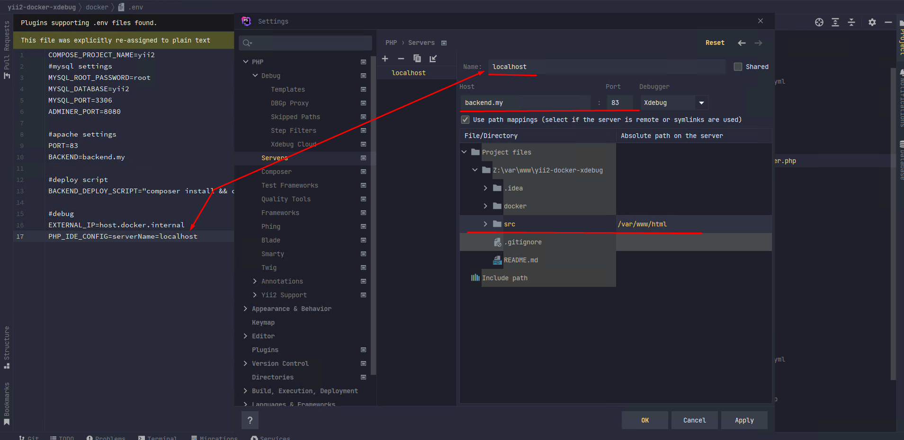
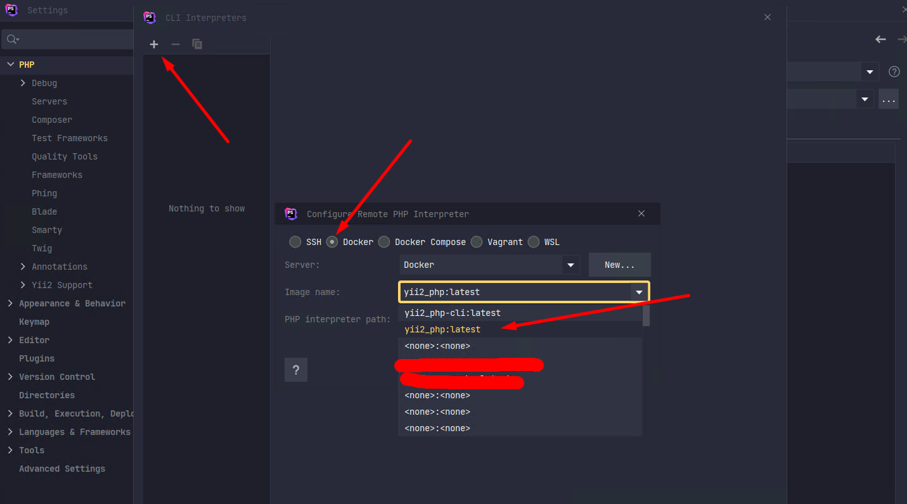
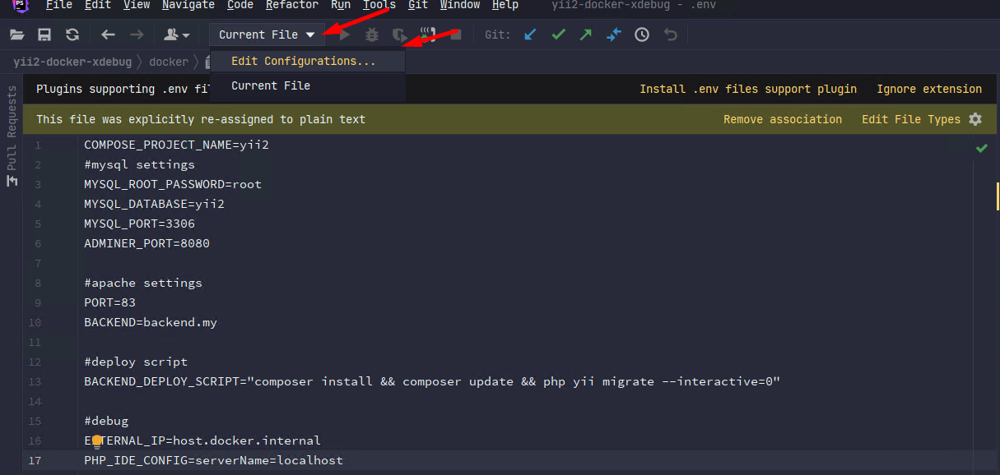
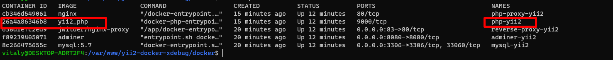
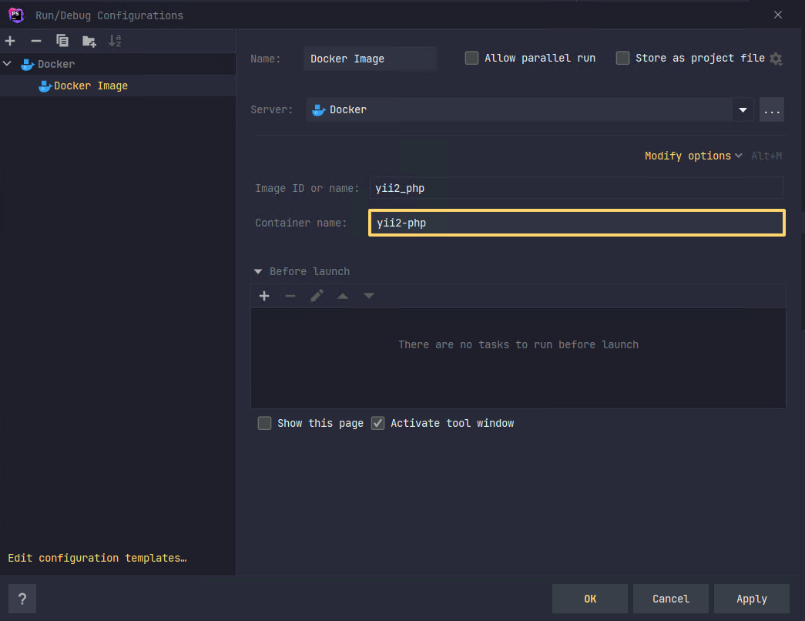

# Yii2 docker xdebug mysql nginx reverse-proxy 
## От автора
Сам пользуюсь wsl2 + docker-desctop инструкция написана в основном для пользователей windows. Однако они справедливы и для пользователей Linux (проверял).

## Используемые техенологии
- php 7.3 + xdebug
- mysql + adminer
- nginx
- reverse-proxy
## Инструкция по запуску
1.  Предварительно установите Docker desctop.
2.  Если у вас уже есть база проекта - сделайте бэкап (потом вставите в текущую).
3.  Создайте файл .env на основе .env.example (можно просто убрать .example вконце).
4.  в .env измените значение переменной BACKEND  на удобное вам.
    -   Это наименование домена, на котором вы сможете запустить сайт.
5.  Зайдите в ваш файл hosts (`C:\Windows\System32\drivers\etc`) и добавьте туда доменные имена, например, у меня так:
```
127.0.0.1 backend.my
```
6. Проверьте чтобы `PORT`, `MYSQL_PORT`, `ADMINER_PORT` не были заняты другими приложениями. в противном случае измените на свои.
7. В консоли перейдите в папку docker и выполните
```
docker-compose up -d
```
*<u>Если по адресу **backend.my:83** откроется стартовая страница yii2, то рабочее окружение вы настроили верно.</u>*
## Настройка xdebug в phpstorm
```
ctrl + alt + S  
```
1. PHP -> Debug -> Servers:
    - Name: `localhost`
    - Host: `backend.my`
    - Port: `83`
    - Mapping: выбираем локальную папку src и соотносим с `/var/www/html` (именно в этой папке в контейнере лежит проект)


2. PHP (пункт меню)
   Cli interpriter -> ... (создать новый) -> from docker
   

3. Панель дебага - редактировать конфигурацию
   ![[Pasted image 20221022153325.png]]
   Из предложенного списка выберите Docker Image
   Перейдите в консоль и наберите
   ```docker ps```
   в php storm вставляем image name и container name
   
   
4. PHP -> Debug -> DBGp Proxy
    - IDE Key: PHPSTORM
Остальное оставить как есть.

5. Установите точку для дебага, скачайте приложение для вашего браузера. и пробуйте запустить
6. Если пользуетесь Postman то лучше создать переменную окружения (в самом постмане):
```
XDEBUG_SESSION_START=phpstorm
```
и после каждого урл (где это необходимо), вставляйте. Например:
```
   {{domain}}/url?{{debug}}
```


